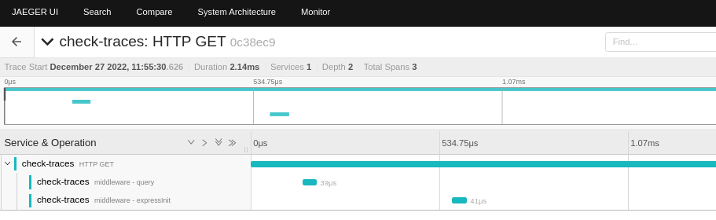

# check-traces

[](https://github.com/obs-nebula/check-traces/actions/workflows/ci.yml)


## Branches

This repository contains the following branches:

* [add-otelcol](https://github.com/obs-nebula/check-traces/tree/add-otelcol) - We need to make some experiments with OTELCOL inside OpenShift Local
* [meta-package](https://github.com/obs-nebula/check-traces/tree/meta-package) - We are using the otel-js [meta-package](https://www.npmjs.com/package/@opentelemetry/auto-instrumentations-node) to test other things
* [sdk-node](https://github.com/obs-nebula/check-traces/tree/sdk-node) - Created to play with enable/disable OTEL-JS

The purpose of this repository is to ensure that a basic Express app's traces are correctly generated and successfully exported to the final destination which is Jaeger.

With this, we can make safer modifications and experiments according to the evolution of the APIs of the OTEL-JS modules.

## How to run locally

```console
# (Optional) You can use this environment variable to point to another Jaeger traces endpoint.
OTEL_EXPORTER_JAEGER_ENDPOINT=http://localhost:14268/api/traces

# This will download and start Jaeger
./scripts/start.sh

# Start the example
npm install
npm start
```

* Go to [localhost:8080](http://localhost:8080)
* Check the result in Jaeger UI [localhost:16686](http://localhost:16686)




## Deploy to OpenShift Local

Make sure to install OpenShift Local and the Jaeger Operator. For this you can follow the 
screenshots [here](https://github.com/nodeshift-starters/nodejs-configmap/blob/main/OTEL.md#install-the-openshift-distributed-tracing-platform-operator). 


Start OpenShift Local:
```console
crc start
eval (crc oc-env)
```

Login and create a project called `foobar`:
```console
oc login -u developer https://api.crc.testing:6443
oc new project foobar
```

The Jaeger endpoint:

```console
oc get svc
```

```
NAME                                            TYPE        CLUSTER-IP     EXTERNAL-IP   PORT(S)                                                    AGE
jaeger-all-in-one-inmemory-agent                ClusterIP   None           <none>        5775/UDP,5778/TCP,6831/UDP,6832/UDP                        2m16s
jaeger-all-in-one-inmemory-collector            ClusterIP   10.217.5.57    <none>        9411/TCP,14250/TCP,14267/TCP,14268/TCP,4317/TCP,4318/TCP   2m16s
jaeger-all-in-one-inmemory-collector-headless   ClusterIP   None           <none>        9411/TCP,14250/TCP,14267/TCP,14268/TCP,4317/TCP,4318/TCP   2m16s
jaeger-all-in-one-inmemory-query                ClusterIP   10.217.5.219   <none>        443/TCP,16685/TCP                                          2m16s
```

Ne need to use `jaeger-all-in-one-inmemory-collector` + our namespace service `foobar.svc` resulting in the following:

```console
OTEL_EXPORTER_JAEGER_ENDPOINT='http://jaeger-all-in-one-inmemory-collector.foobar.svc:14268/api/traces'
```

Create new app:
```console
oc new-app registry.access.redhat.com/ubi8/nodejs-18~https://github.com/obs-nebula/check-traces -e OTEL_EXPORTER_JA
EGER_ENDPOINT='http://jaeger-all-in-one-inmemory-collector.foobar.svc:14268/api/traces'
```

To follow the build/push:
```console
oc logs -f buildconfig/check-traces
# or
oc logs -f bc/check-traces
```

Expose the app:
```console
oc expose svc/check-traces
```

Go to the exposed app:

[http://check-traces-foobar.apps-crc.testing/](http://check-traces-foobar.apps-crc.testing/)


Access the Jaeger UI

```console
oc get routes
```

```
NAME                         HOST/PORT                                            PATH   SERVICES                           PORT          TERMINATION   WILDCARD
check-traces                 check-traces-foobar.apps-crc.testing                        check-traces                       8080-tcp                    None
jaeger-all-in-one-inmemory   jaeger-all-in-one-inmemory-foobar.apps-crc.testing          jaeger-all-in-one-inmemory-query   https-query   reencrypt     None
```

[https://jaeger-all-in-one-inmemory-foobar.apps-crc.testing](https://jaeger-all-in-one-inmemory-foobar.apps-crc.testing)

# Cleanup

```console
oc delete all --selector app=check-traces
```

Or delete the project

```console
oc delete project foobar
```
abc